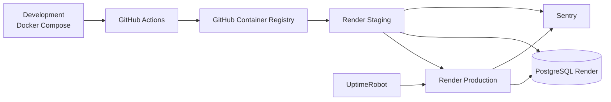

# Reach17

Reach17 è un'applicazione web per la gestione di corsi, tipologie formative e atenei. Il backend è sviluppato con Node.js ed Express, le pagine sono renderizzate con EJS e i dati sono salvati in PostgreSQL.

## Architettura



I componenti principali sono:

- un'applicazione Node.js/Express con template EJS;
- un database PostgreSQL;
- Docker e Docker Compose per l'ambiente locale;
- GitHub Actions per CI/CD e GitHub Container Registry (GHCR) per le immagini;
- Render per staging e production;
- UptimeRobot e Sentry per monitoraggio ed error tracking.

## Ambienti

| Ambiente | Esecuzione | Scopo |
| --- | --- | --- |
| Development | Docker Compose locale | Sviluppo e verifica con applicazione e PostgreSQL containerizzati |
| Staging | Render | Validazione automatica prima della promozione in production |
| Production | Render | Servizio pubblico monitorato |

Staging e production condividono attualmente la stessa istanza PostgreSQL su Render a causa dei limiti del piano gratuito. Questa scelta riduce l'isolamento tra gli ambienti ed è adatta esclusivamente al contesto del progetto accademico.

## Configurazione dell'ambiente

Creare il file locale `.env` a partire da `.env.example` e valorizzare le variabili senza commettere credenziali nel repository.

| Variabile | Descrizione |
| --- | --- |
| `DB_USER` | Utente usato dall'applicazione per PostgreSQL |
| `DB_HOST` | Host PostgreSQL; in Compose corrisponde al nome del servizio `postgres` |
| `DB_NAME` | Nome del database applicativo |
| `DB_PASSWORD` | Password dell'utente PostgreSQL |
| `DB_PORT` | Porta PostgreSQL, normalmente `5432` |
| `SENTRY_DSN` | DSN del progetto Sentry |
| `APP_ENV` | Ambiente applicativo: `development`, `staging` o `production` |
| `APP_VERSION` | Versione/tag dell'immagine usata in locale da Docker Compose |

Il servizio PostgreSQL locale richiede inoltre `POSTGRES_USER`, `POSTGRES_DB` e `POSTGRES_PASSWORD`; devono corrispondere rispettivamente a `DB_USER`, `DB_NAME` e `DB_PASSWORD`.

`.env` è escluso da Git. `.env.example` documenta il contratto di configurazione e deve contenere soltanto nomi delle variabili o valori di esempio non sensibili. Secrets e credenziali reali non devono mai essere committati.

## Avvio locale con Docker Compose

Prerequisiti: Git, Docker e Docker Compose.

```bash
git clone https://github.com/MarcoSar1991/nodeJs_Server_with_Postgres.git
cd nodeJs_Server_with_Postgres
cp .env.example .env
docker compose up --build
```

L'applicazione è disponibile su <http://localhost:3000>. Per arrestare e rimuovere i container:

```bash
docker compose down
```

PostgreSQL salva i dati nel named volume `postgres_data`. `docker compose down` conserva il volume e i dati; per eliminare anche il database locale e ripartire da zero usare:

```bash
docker compose down -v
```

## Inizializzazione del database

Alla prima creazione del volume PostgreSQL, `db/migrations.sql` crea lo schema e `db/seed.sql` inserisce i dati iniziali. Gli script sono montati in `/docker-entrypoint-initdb.d` ed eseguiti automaticamente nell'ordine indicato.

PostgreSQL non riesegue questi script quando il volume è già inizializzato. Per ripetere l'inizializzazione locale occorre eliminare il volume con `docker compose down -v` e riavviare i servizi.

## Quality e security checks

I controlli eseguiti dalla pipeline possono essere riprodotti localmente:

```bash
npm ci
npm run lint
npm test
npm audit --omit=dev --audit-level=high
```

I test unitari dei controller sono scritti con Mocha e Chai e usano Sinon per stub e spy. Non richiedono un database attivo perché l'accesso ai model viene simulato. La pipeline fallisce in modo visibile se uno dei controlli obbligatori non termina correttamente.

## Docker

Il `Dockerfile` produce un'immagine orientata alla produzione basata su Node 22 Alpine. Copia prima i manifest npm, installa soltanto le dipendenze production con `npm ci --omit=dev`, imposta `NODE_ENV=production`, espone la porta `3000` ed esegue `npm start` con l'utente non-root `node`.

`.dockerignore` esclude dal build context dipendenze locali, repository Git, `.env`, log, coverage e file IDE. I secrets vengono forniti esclusivamente a runtime.

## CI/CD

Il workflow GitHub Actions si attiva su ogni pull request verso `main` e su ogni push a `main`.

Per le pull request esegue:

1. installazione riproducibile con `npm ci`;
2. lint;
3. test;
4. audit delle dipendenze production;
5. build dell'immagine Docker senza pubblicazione o deploy.

Per i push su `main` esegue gli stessi controlli CI e poi:

1. costruisce l'immagine Docker con un tag basato sul commit SHA;
2. pubblica l'immagine su GitHub Container Registry;
3. avvia il deploy automatico in staging;
4. esegue uno smoke test sullo staging;
5. promuove la stessa immagine in production;
6. esegue uno smoke test sulla production.

Run CI/CD finale: **https://github.com/MarcoSar1991/nodeJs_Server_with_Postgres/actions/runs/36246006443**

## Strategia degli artifact

In locale Docker Compose usa `APP_VERSION` come tag dell'immagine. In CI/CD ogni immagine è identificata dal commit SHA, che collega in modo univoco codice e artifact. La stessa immagine immutabile validata in staging viene promossa in production senza essere ricostruita.

## Deploy

- Staging: <https://reach17-mg4l.onrender.com>
- Production: <https://reach17-4vux.onrender.com>

## Monitoring

UptimeRobot controlla periodicamente l'URL di production. Un alert di downtime indica che il servizio non ha risposto correttamente per il numero di verifiche configurato: occorre controllare stato e log del servizio Render, ultima run CI/CD e dipendenze esterne.

Sentry raccoglie gli errori applicativi e distingue gli eventi tramite `APP_ENV` negli ambienti `development`, `staging` e `production`. Un evento Sentry mostra eccezione, stack trace, ambiente e frequenza; questi dati consentono di capire l'impatto, individuare il punto del codice e confrontare l'orario dell'errore con i deploy recenti.

## Sicurezza

- `.env` è escluso da Git e i secrets non sono hardcodati nel codice o nell'immagine;
- i deploy hook Render sono conservati in GitHub Secrets;
- gli URL pubblici di staging e production sono configurati come GitHub Variables;
- credenziali PostgreSQL e configurazione Sentry sono gestite tramite Render Environment Variables;
- il processo Node nel container viene eseguito come utente non-root;
- la pipeline controlla le dipendenze production con `npm audit --omit=dev --audit-level=high`.

## Struttura del progetto

- `app.js`: entrypoint Express e configurazione delle route;
- `instrument.js`: inizializzazione di Sentry;
- `config/`: connessione a PostgreSQL;
- `controllers/`: logica applicativa;
- `models/`: accesso ai dati;
- `routes/`: definizione delle route;
- `views/`: template EJS;
- `public/`: risorse statiche;
- `test/`: test unitari Mocha, Chai e Sinon;
- `db/`: schema e dati iniziali;
- `.github/workflows/`: pipeline CI/CD;
- `Dockerfile` e `docker-compose.yaml`: container production e ambiente locale.

## Link utili

- Repository: <https://github.com/MarcoSar1991/nodeJs_Server_with_Postgres>

## Licenza

Il progetto è distribuito con licenza MIT. Il testo completo è disponibile nel file `LICENSE`.
